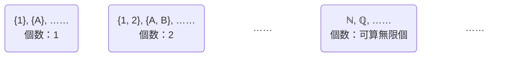

## 定義
**濃度**は有限集合の元の個数を「個数が等しい」とはどういうことかに注目して無限集合にも適用できるような概念に拡張したもの。

集合 $A$ と集合 $B$ の個数が等しいことを「元が一対一対応すること」と捉えなおす。
集合 $A$ と集合 $B$ に**全単射**な写像 $f \colon A \to B$ が存在するとき、 $A$ と $B$ は**対等**であるという。

いろんな集合を対等な集合どうしでグループ分けすることができる。（対等は同値関係なので同値類を考えている、ような感じ）

それぞれのグループを**濃度**と呼ぶ。
元の個数が1個のグループの濃度は「1」、元の個数が2個のグループの濃度は「2」、……と名前を付ける。
自然数全体の集合の濃度を $\aleph_0$ , 実数全体の集合の濃度を $\aleph$ と表す。

集合$A$の濃度は $\mathrm{card} A$ と表す。
例えば、
$$
\mathrm{card} \mathbb{N} = \aleph_0
$$
となる。

## 濃度の演算
ある濃度 $\mathfrak{m}$ と $\mathfrak{n}$ の間での演算は、それぞれの濃度に属する集合をとってきて集合どうしの演算で定義する。
$\mathfrak{m} = \mathrm{card} A, \mathfrak{n} = \mathrm{card} B$となる集合 $A, B$ に対して、
和は
$$
\mathfrak{m} + \mathfrak{n} \stackrel{\mathrm{def}}{=} \mathrm{card} (A \cup B),
$$
（ただし $A \cap B = \emptyset$ が前提）

積は
$$
\mathfrak{m} \mathfrak{n} \stackrel{\mathrm{def}}{=} \mathrm{card} (A \times B)
$$

べき乗は
$$
\mathfrak{n}^{\mathfrak{m}} \stackrel{\mathrm{def}}{=} \mathrm{card} \{ f \bigm| f \colon A \to B \}
$$
（ただし $\mathfrak{m}, \mathfrak{n} \geq 1$ が前提）
で定義する。

有限の濃度の場合は、非負整数の和・積・べき乗の計算と一致するので、自然な拡張になっている。
交換律・結合律・分配律・指数法則も成立する。

## 簡約律
簡約律は一般には成立しない。
$$
\begin{aligned}
  \mathfrak{m} + \mathfrak{p} = \mathfrak{n} + \mathfrak{p} & \Rightarrow \mathfrak{m} = \mathfrak{n} \\
  \mathfrak{m} \mathfrak{p} = \mathfrak{n} \mathfrak{p} & \Rightarrow \mathfrak{m} = \mathfrak{n}
\end{aligned}
$$
とは一概には言えない。
例えば、
$$
\begin{aligned}
  1 + \aleph_0 & = 2 + \aleph_0 & = \cdots & = \aleph_0 + \aleph_0 & = \aleph_0 \\
  1 \aleph_0 & = 2 \aleph_0 & = \cdots & = \aleph_0 \aleph_0 & = \aleph_0
\end{aligned}
$$
である。
無限の濃度が絡んできたときは、よりデカい濃度に吸収されてしまう、というイメージ。

## 連続体仮説
$$
  \aleph_0 < \mathfrak{m} < \aleph = 2^{\aleph_0}
$$
を満たすような濃度 $\mathfrak{m}$ は存在しない
という主張を**連続体仮説**という。
ZFC公理系では証明も反証もできない（真偽が定まらない）らしい。不思議。
もしこんな中間の濃度が存在すると仮定したとしても、具体的にどんな集合がその濃度になるかは構成できなさそう、気持ちわる～いね。