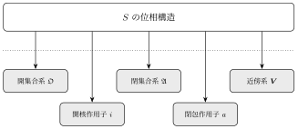

## 位相

空でない集合 $S$ に対して、以下の公理を満たす部分集合系 $\mathfrak{O}$ を $S$ の**位相**と呼ぶ。
[[from-euclidean-to-topology|▶位相の気持ちについての参考]]

> [!abstract] 位相の公理
>
> $\mathrm{(Oi)} \ S \in \mathfrak{O}$ かつ $\varnothing \in \mathfrak{O}$
>
> $\mathrm{(Oii)} \ O_1, O_2 \in \mathfrak{O}$ ならば $O_1 \cap O_2 \in \mathfrak{O}$
>
> $\mathrm{(Oiii)} \ \mathfrak{O}$ の元からなる任意の集合族 $(O_\lambda)_{\lambda \in \Lambda}$ について、$\displaystyle\bigcup_{\lambda \in \Lambda} O_\lambda \in \mathfrak{O}$

正確には $\mathfrak{O}$ は**開集合系**であり、位相はより抽象的な数学的構造のことを指している、ともいえる。

なぜか？

開集合系でない別のものでも、**実質的に同じ位相構造が定まるものがいろいろある**からだ。

## 閉集合系

まず思いつく代わりになりそうなものは**閉集合系**だ。
位相空間 $(S, \mathfrak{O})$ における**閉集合**は、**ある開集合の補集合で表される集合**のこと。

つまり、開集合系 $\mathfrak{O}$ の元と閉集合系 $\mathfrak{A}$ の元は一対一に対応する。
情報量は全く同じなので、以下の公理から位相（閉集合系）を定めて、「開集合は閉集合の補集合」と定義して進めても同じことになる。

> [!abstract] 閉集合系の公理
>
> $\mathrm{(Ai)} \ S \in \mathfrak{A}$ かつ $\varnothing \in \mathfrak{A}$
>
> $\mathrm{(Aii)} \ A_1, A_2 \in \mathfrak{A}$ ならば $A_1 \cup A_2 \in \mathfrak{A}$
>
> $\mathrm{(Aiii)} \ \mathfrak{A}$ の元からなる任意の集合族 $(A_\lambda)_{\lambda \in \Lambda}$ について、$\displaystyle\bigcap_{\lambda \in \Lambda} A_\lambda \in \mathfrak{A}$

これを満たす部分集合系 $\mathfrak{A}$ を定めると、
**閉集合系が $\mathfrak{A}$ に一致するような位相（開集合系） $\mathfrak{O}$ がただ一つ存在する。**

というわけで、実質的に同じ位相構造が定まる、と言えるわけだ。

## 開核作用子

部分集合 $M \subset S$ に対して、
$M$ に含まれる最大の開集合を、 $M$ の**内部**と言い $M^i$ とか $M^\circ$ とか表す。

$S$ の部分集合それぞれに対して、それらの内部を対応させる写像を考えることができる。
そのような写像 $i \colon \mathfrak{P}(S) \to \mathfrak{P}(S), M \mapsto M^i$ を**開核作用子**という。

以下の公理を満たす写像として開核作用子 $i$ を定めてから、「開集合は、 $i(M) = M$ となる集合」として定義して進めても同じことになる。

> [!abstract] 開核作用子の公理
>
> $\mathrm{(Ii)} \ i(S) = S$
>
> $\mathrm{(Iii)} \ $ 任意の $M \in \mathfrak{P}(S)$ に対して $i(M) \subset M$
>
> $\mathrm{(Iiii)} \ $ 任意の $M, N \in \mathfrak{P}(S)$ に対して $i(M \cap N) = i(M) \cap i(N)$
>
> $\mathrm{(Iiv)} \ $ 任意の $M \in \mathfrak{P}(S)$ に対して $i(i(M)) = i(M)$

## 閉包作用子

同様に、部分集合 $M \subset S$ に対して、
$M$ を含む最小の閉集合を、 $M$ の**閉包**と言い $M^a$ とか $\bar{M}$ とか表す。

$S$ の部分集合それぞれに対して、それらの閉包を対応させる写像を考えることができる。
そのような写像 $a \colon \mathfrak{P}(S) \to \mathfrak{P}(S), M \mapsto M^a$ を**閉包作用子**という。

以下の公理を満たす写像として閉包作用子 $a$ を定めてから、「閉集合は、 $a(M) = M$ となる集合」として定義して進めても同じことになる。

> [!abstract] 閉包作用子の公理
>
> $\mathrm{(Ki)} \ a(\varnothing) = \varnothing$
>
> $\mathrm{(Kii)} \ $ 任意の $M \in \mathfrak{P}(S)$ に対して $a(M) \supset M$
>
> $\mathrm{(Kiii)} \ $ 任意の $M, N \in \mathfrak{P}(S)$ に対して $a(M \cup N) = a(M) \cup a(N)$
>
> $\mathrm{(Kiv)} \ $ 任意の $M \in \mathfrak{P}(S)$ に対して $a(a(M)) = a(M)$

この公理系を*Kuratowskiの公理系*ともいうらしい。

## 近傍系

任意の点 $x \in S$ に対して、
$x$ が内点になるような集合 $V \subset S$ を $x$ の**近傍**という。
点 $x$ の近傍全体の集合を $x$ の**近傍系**と言い $\bm{V}(x)$ と表す。

「部分集合 $V$ が $x$ の近傍である」 $\Leftrightarrow$ 「 $x \in O, O \subset V$ となる開集合 $O$ が存在する」
であり、
「部分集合 $O$ が開集合である」 $\Leftrightarrow$ 「 任意の $ x \in O$ に対して $O \in \bm{V}(x)$ 」
なので、
近傍系を定めることと開集合を定めることは同じくらいの情報量がありそうな気がする。

実際、次の公理を満たす写像 $h \colon S \to \mathfrak{P}(\mathfrak{P}(S))$ として近傍系を定めてから開集合を定義して進めても同じことになる。

> [!abstract] 近傍系の公理
>
> $\mathrm{(Vi)} \ $ 任意の $V \in h(x)$ に対して $x \in V$
>
> $\mathrm{(Vii)} \ V \in h(x)$ かつ $V \subset U$ ならば $U \in h(x)$
>
> $\mathrm{(Viii)} \ U, V \in h(x)$ ならば $U \cap V \in h(x)$
>
> $\mathrm{(Viv)} \ $ 任意の $V \in h(x)$ に対して、「任意の $y \in U$ に対して $V \in h(y)$ 」を満たすような $U \in h(x)$ が存在する。

この公理系を*Hausdorffの公理系*ともいうらしい。
[Wikipedia](https://ja.wikipedia.org/wiki/%E4%BD%8D%E7%9B%B8%E3%81%AE%E7%89%B9%E5%BE%B4%E4%BB%98%E3%81%91) によると、ハウスドルフによるオリジナルの位相空間の定義はこの公理系とはちょっと違うらしい。

## まとめ

結局、開集合系・閉集合系・開核作用子・閉包作用子・近傍系のどれか一つを定めれば、残りの概念は一意に定まる。
位相はこれらを定める一段階上の抽象的な概念で、開集合系などの概念は位相がおとす影のようなものと言えるのかも。

[Wikipedia](https://ja.wikipedia.org/wiki/%E4%BD%8D%E7%9B%B8%E3%81%AE%E7%89%B9%E5%BE%B4%E4%BB%98%E3%81%91) によると、
「同じ位相構造を定める」というのは「それぞれの概念から定まる圏が同型になる」ということらしい。（圏論わからない）

<figure class="tikz-figure">
  
</figure>
