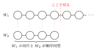
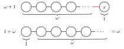

**順序数**は**濃度**のときよりもさらに自然数特有の雰囲気を反映させて拡張した概念。

濃度のときは集合の元の個数に注目した。有限個なら個数は自然数で、「無限個ならどうなる？」と考えて拡張したものだった。
今度は自然数全体の集合 $\mathbb{N}$ がもつ **「整列集合である」** という性質に注目して考える。

[[cardinality|▶濃度について]]

## 整列集合

順序集合 $(W, \preceq)$ が
**「$W$ の任意の空でない部分集合が、常に最小元をもつ」**
という性質を満たすとき、 $(W, \preceq)$ を **整列集合** という。

> [!note]+ 順序関係
>
> 集合 $W$ において関係 $\preceq$ が次の性質を満たすとき、この関係を**順序関係**という。
> $a, b, c$ を $W$ の任意の元とすると、
>
> 1. $a \preceq a$（反射律）
>
> 2. $a \preceq b , b \preceq a \Rightarrow a = b$（反対称律）
>
> 3. $a \preceq b , b \preceq c \Rightarrow a \preceq c$（推移律）
>
> 例えば、大小関係 $\leq$ は $\mathbb{N}$ における順序関係。
> 自然数の大小関係は常にどの2つの元も大小（順序）を比較できるが、できない順序関係もある。
> 例えば、整除関係（ $a$が $b$ を割り切るときに $a \preceq b$ とする）は $\mathbb{N}$ における順序関係になるが、$2$ と $3$ は比較できない（順序が定まらない）。

$\mathbb{N}$ は整列集合になっている。
例えば、
部分集合 $\{ 1, 2, 3 \}$の最小元は $1$ 。
部分集合 $\{ 2, 4, 6, 8, \cdots \}$の最小元は $2$ 。
どんな部分集合をとってきても最小元が存在する。

---

なぜ**整列**なのか。

整列集合 $(W, \preceq)$ の任意の元 $a$ に注目する。
$a$ より大きい元を集めた部分集合 $\{ x \in W \bigm| a \preceq x, a \neq x \}$ にももちろん最小元が存在する。
それを $a'$ とすると、 $a$ と $a'$ の間にくる元はなくて、 $a'$ は正真正銘 $a$ の**次**の元と言える。

これを $W$ の最小元から続けていけば、先頭から順に次の元、次の次の元、次の次の次の元、……と一列に並んでいく。

<figure class="tikz-figure">
  
</figure>

ちなみに $a$ より小さい元を集めた部分集合 $\{ x \in W \bigm| x \preceq a, x \neq a \}$ のことを $W$ の $a$ における**切片**という。

<figure class="tikz-figure">
  
</figure>

## 順序同型

2つの順序集合 $(W_1, \preceq_{1}), (W_2, \preceq_{2})$ の間で順序関係が*同じ*とはどういうことだろう。

濃度のときの「個数が同じ」は、元が一対一対応することだった。
「順序が同じ」は、元が一対一対応し、さらに順序も保たれていることと言える。

つまり、ある写像 $f \colon W_1 \to W_2$ があって、

- 全単射
- $a \preceq b \Leftrightarrow f(a) \preceq f(b)$

となってくれるなら、 $(W_1, \preceq_{1})$ と $(W_2, \preceq_{2})$ は**順序同型**であるという。

---

いろんな順序集合を順序同型な集合どうしでグループ分けすることができる。
（順序同型は同値関係なので同値類を考えている、ような感じ）

それぞれのグループを**順序型**という。
順序集合 $(W, \preceq)$ の順序型を $\mathrm{ord} W$ と表す。

ただし、順序型はパターンが無数にありすぎて、それぞれのグループ間の関係がすんなりと言えない。
同じ大小関係でも $(\mathbb{N}, \leq), (\mathbb{Z}, \leq), (\mathbb{Q}, \leq)$ は性質が違いすぎる。
整数は小さいほうと大きいほうで無限に伸びるし、有理数はどの2つの元の間にも無限に数がある。

そこで、**整列集合**に限って考えるといい感じになる。

## 順序数の定義

**整列集合の順序型**を**順序数**という。

$n$ 個の元からなる有限整列集合は、 $(\{ 1, 2, \cdots, n \}, \leq)$ と順序同型になるので、その順序数は $n$ と表す。
空集合の順序数は $0$ とする。
無限整列集合の順序数を、**超限順序数**という。

---

順序*数*と言えるようなうまい性質があるのか？

実は任意の整列集合 $(W_1, \preceq_{1})$ と $(W_2, \preceq_{2})$ との間には、常に

1. $W_1$ と $W_2$ が順序同型
2. $W_1$のある切片と $W_2$ が順序同型
3. $W_1$ と $W_2$ のある切片が順序同型

のいずれか1つだけが成り立つ。
つまり、完全に一致するか、どちらかの _しっぽ_ を切れば一致するか、のどちらかになっている。

<figure class="tikz-figure">
  
</figure>

この性質のおかげで、順序数の大小を定義できる。

任意の順序数 $\mu, \nu$ に対して、
$\mu = \mathrm{ord} W_1, \nu = \mathrm{ord} W_2$ となる整列集合 $W_1, W_2$ を比較して、

1. 1の場合なら $\mu = \nu$ 、
2. 2の場合なら $\mu < \nu$ 、
3. 3の場合なら $\mu > \nu$

と定義する。

特に自然数全体の集合の順序数を $\omega = \mathrm{ord} \mathbb{N}$ と表す。

## 順序数の演算

ある順序数 $\mu$ と $\nu$ の間の演算は、もとになる整列集合から新たな整列集合を作り定義する。
$\mu = \mathrm{ord} A, \nu = \mathrm{ord} B$ となる集合 $A, B$ に対して、

順序数の和 $\mu + \nu$ は、 $A$ の後ろに $B$ をつなげた順序をもつ整列集合の順序数とする。
図で考えれば一目瞭然だと思う。

順序数 $2$ と $3$ の和は、

<figure class="tikz-figure">
  
</figure>

順序数 $\omega$ と $1$ の和は、

<figure class="tikz-figure">
  
</figure>

となる。

> [!note]- 正確な和の定義
>
> 正確には、$A \cup B \ (A \cap B = \emptyset)$ に次のような順序を定義した整列集合の順序数とする。
>
> $x, y \in A \cup B$ に対して、次のいずれかが成り立つとき $x \preceq y$ とする。
>
> 1. $\ x \in A, y \in B$
> 2. $\ x \preceq_{A} y \ (x, y \in A)$
> 3. $\ x \preceq_{B} y \ (x, y \in B)$
>
> $\preceq_{A}, \preceq_{B}$ はそれぞれ$A, B$のもともとの順序。

---

ここで、一番後ろの元 $x$ はどんな自然数よりも*大きい*元である。
どの元にも**直後**の元はあるが、**直前**の元があるとは限らない。
$x$ には直前の元はない。 $x$ の前には無限個の元が詰まっている。

順序数の大小においても、**直後**の順序数はあるが、**直前**の順序数があるとは限らない。
$\omega$ には直前の順序数はない。そのような順序数を**極限数**という。（直前がある順序数は**孤立数**という。）

---

さらに和の定義において、鎖をつなげる順番が重要なので、交換則は一般に成り立たない。

$\omega + 1$ と $1 + \omega$ は異なる。

<figure class="tikz-figure">
  
</figure>

---

順序数の積 $\mu \cdot \nu$ は、 $A$ を $\nu$ 個分複製してつなげた整列集合の順序数とする。

<figure class="tikz-figure">
  
</figure>

> [!note]- 正確な積の定義
>
> 正確には、直積 $A \times B$ に次のような順序を定義した整列集合の順序数とする。
>
> $(a, b), (a', b') \in A \times B$ に対して、
>
> $$
> (a, b) \preceq (a', b') \stackrel{\mathrm{def}}{\Longleftrightarrow}
> \begin{cases}
>   b \preceq_{B} b' \ (b \neq b') \\
>   a \preceq_{A} a' \ (b = b')
> \end{cases}
> $$
>
> $\preceq_{A}, \preceq_{B}$ はそれぞれ$A, B$のもともとの順序。

これも積の順序が重要なので、交換則は一般に成り立たない。

$\omega \cdot 2$ と $2 \cdot \omega$ は異なる。

<figure class="tikz-figure">
  
</figure>

---

順序数をずらっと並べると、下のような感じになる。

$$
\begin{aligned}
  & 0, \ 1, \ 2, \ \cdots, \\
  & \omega, \ \omega + 1, \ \omega + 2, \ \cdots, \\
  & \omega \cdot 2, \ \omega \cdot 2 + 1, \ \cdots, \\
  & \omega \cdot 3, \ \cdots, \ \omega \cdot n, \ \cdots, \\
  & \omega^2, \ \cdots, \ \omega^3, \ \cdots, \ \omega^{\omega}, \ \cdots
\end{aligned}
$$
